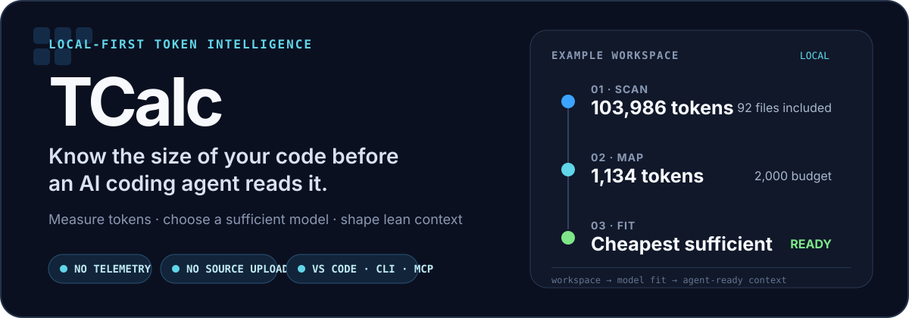
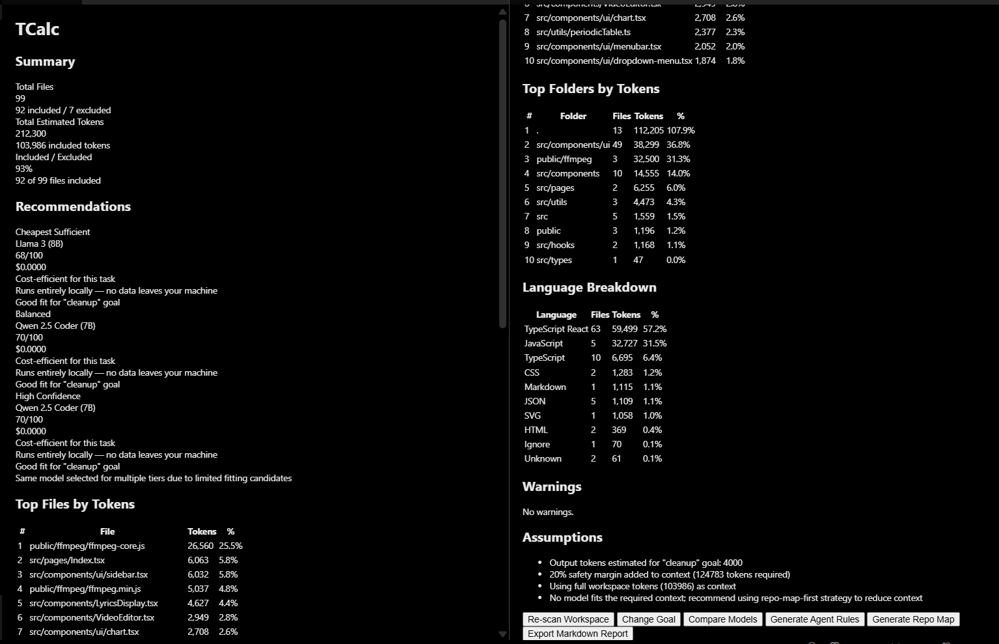
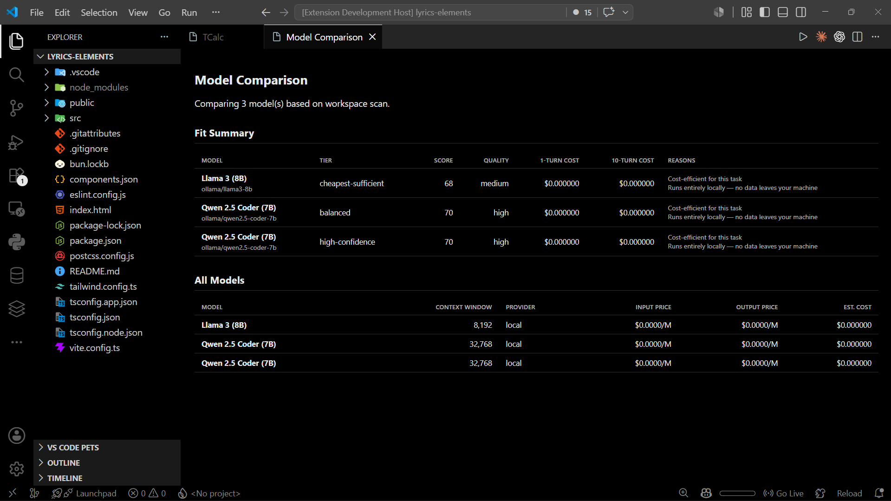
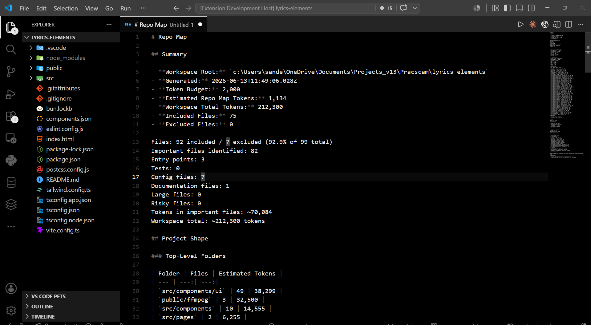

<p align="center">
  
</p>

<p align="center">
  <a href="https://marketplace.visualstudio.com/items?itemName=Sandesh13fr.tcalc"></a>
  <a href="https://open-vsx.org/extension/Sandesh13fr/tcalc"></a>
  <a href="https://github.com/Sandesh13fr/TCalc/releases"></a>
  <a href="https://tcalc-one.vercel.app/"></a>
  <a href="https://github.com/Sandesh13fr/TCalc/actions/workflows/ci.yml"></a>
  <a href="./LICENSE"></a>
</p>

<p align="center">
  Scan a codebase once. See where its context goes, which model is enough for the job, and what your coding agent should read first.<br>
  <strong>Everything runs locally: no telemetry, cloud calls, or source upload.</strong>
</p>

<p align="center">
  <a href="#start-in-vs-code">Install</a> ·
  <a href="#see-the-workspace-before-your-agent-does">See it work</a> ·
  <a href="#use-the-cli">CLI</a> ·
  <a href="#connect-your-coding-agent">Coding agents</a>
  &middot; <a href="https://tcalc-one.vercel.app/">Website</a>
</p>

## See the workspace before your agent does



TCalc respects workspace ignore rules, estimates tokens by file, folder, and language, then recommends models against the actual context and your current goal.

| Compare models against the scan | Generate a budgeted repo map |
| --- | --- |
|  |  |

## One scan, three useful decisions

| | Decision | TCalc produces |
| --- | --- | --- |
| **01** | **What is consuming context?** | Included and excluded files, token-heavy paths, folders, languages, and warnings. |
| **02** | **Which model is enough?** | Cheapest-sufficient, balanced, and high-confidence options with context fit and estimated cost. |
| **03** | **What should the agent read?** | Budgeted repo maps, goal-aware agent rules, reports, and ready-to-use MCP configuration. |

The scanner, recommender, report generator, and integrations share the same local-first core. Model catalogs stay provider-neutral, and recommendations change with the task rather than hard-coding one model as “best.”

## Start in VS Code

Install **TCalc** from the [VS Code Marketplace](https://marketplace.visualstudio.com/items?itemName=Sandesh13fr.tcalc) or [Open VSX](https://open-vsx.org/extension/Sandesh13fr/tcalc), then run:

```text
Command Palette → TCalc: Quick Start
```

The guided flow scans the open workspace, sets a goal, compares models, and opens the dashboard. You can also install a downloaded release directly:

```bash
code --install-extension tcalc-*.vsix
```

See the [VSIX installation guide](./docs/install-vsix.md) for the local package workflow. A source-built [JetBrains plugin](./docs/jetbrains-plugin.md) is also available as an MVP for IntelliJ-based IDEs.

## Use the CLI

Build once, then scan, compare, or generate only the context you need:

```bash
pnpm install
pnpm build

pnpm cli scan ./my-project
pnpm cli recommend ./my-project --goal build-mvp
pnpm cli repo-map ./my-project --budget 8000
pnpm cli rules ./my-project --target codex --mode repo-map-first
```

Other commands generate Markdown/JSON reports, validate model catalogs, create MCP configs, and start the local MCP server. Run `pnpm cli --help` for the complete command list.

## Connect your coding agent

TCalc can expose the same scan, recommendation, repo-map, rules, and report capabilities over stdio MCP. It also generates agent rule files and client configuration without uploading source code.

| Tool | Integration | Guide |
| --- | --- | --- |
| [Cursor](https://cursor.com/) | MCP + `.cursorrules` | [Setup](./docs/integrations/cursor.md) |
| [Continue](https://continue.dev/) | MCP | [Setup](./docs/integrations/continue.md) |
| [Claude Desktop](https://claude.ai/download) | MCP | [Setup](./docs/integrations/claude-desktop.md) |
| [Claude Code](https://docs.anthropic.com/en/docs/claude-code) | MCP + `CLAUDE.md` | [Setup](./docs/integrations/claude-code.md) |
| [Cline](https://github.com/cline/cline) | MCP | [Setup](./docs/integrations/cline.md) |
| [Roo](https://github.com/RooVeteran/Roo) | MCP | [Setup](./docs/integrations/roo.md) |
| Any stdio MCP client | MCP | [Generic setup](./docs/integrations/generic-mcp.md) |

```bash
# Generate a client config
pnpm cli mcp-config --target cursor
pnpm cli mcp-config --target continue --output continue-mcp.yaml

# Start the experimental local server
pnpm cli mcp
```


> [!NOTE]
> The MCP server is an experimental MVP: stdio transport only, with no hosted mode. Repo maps are structural and do not expose full source file bodies. See the [MCP documentation](./docs/mcp-server.md) for tools, resources, prompts, security boundaries, and current limits.

## Repository map

<details>
<summary><strong>Packages and applications</strong></summary>

| Package | Role |
| --- | --- |
| `@wma/core` | Shared types, configuration, and constants |
| `@wma/scanner` | Workspace discovery, ignores, and classification |
| `@wma/tokenizers` | Heuristic and provider-specific token estimation |
| `@wma/model-catalog` | Model metadata and catalog validation |
| `@wma/recommender` | Goal-aware fit, scoring, and cost estimates |
| `@wma/repo-map` | Context-budgeted structural maps and symbols |
| `@wma/agent-rules` | Rules for Codex, Claude Code, Cursor, and other agents |
| `@wma/reports` | Markdown and JSON reports |
| `@wma/mcp-server` | Local stdio MCP tools, resources, and prompts |
| `apps/cli` | Commander-based CLI |
| `apps/vscode-extension` | VS Code dashboard and commands |
| `apps/jetbrains-plugin` | IntelliJ Platform plugin MVP |
| `apps/dashboard` | Plain HTML/CSS/JS website and optional report service |

</details>

## Project guides

### Troubleshooting VS Code test output

- Missing `catalogs/models.json` or `.tcalc/models.json` files are optional workspace overrides; TCalc uses the catalogue bundled with the extension when neither exists.
- Messages that reference `embeddings.vscode-cdn.net` come from VS Code/Copilot semantic tooling, not TCalc. Update VS Code and Copilot, then run **Developer: Reload Window**. TCalc does not fetch remote embeddings. VS Code documents both its [CDN network endpoint](https://code.visualstudio.com/docs/setup/network) and that [embedding-backed features require connectivity](https://code.visualstudio.com/docs/agent-customization/language-models).

- [Configuration schema](./instructions.md)
- [Coding-agent integrations](./docs/integrations/README.md)
- [CI reporter](./docs/ci-reporter.md)
- [Release checklist](./docs/release-checklist.md)
- [Contributing](./CONTRIBUTING.md)
- [Security policy](./SECURITY.md)

## License

[MIT](./LICENSE)
