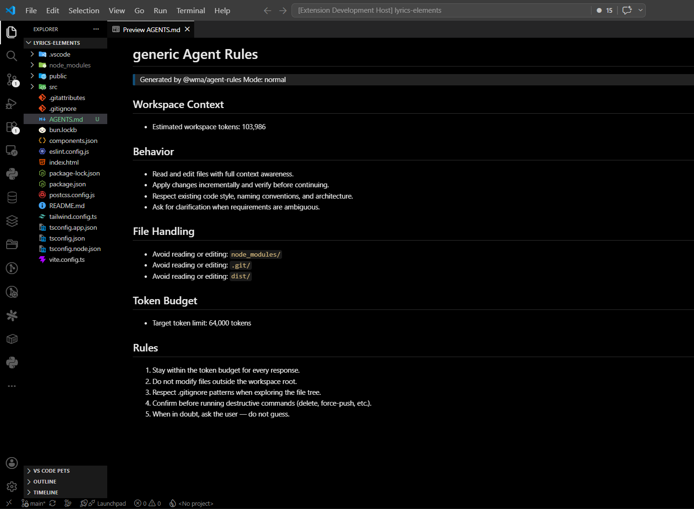

# TCalc

[](https://marketplace.visualstudio.com/items?itemName=Sandesh13fr.tcalc)
[](https://open-vsx.org/extension/Sandesh13fr/tcalc)
[](https://github.com/Sandesh13fr/TCalc/releases)
[](https://github.com/Sandesh13fr/TCalc/actions/workflows/ci.yml)
[](LICENSE)

**Local-first workspace token calculator, model recommender, and coding-agent optimizer.**

Estimate token usage, compare AI models, generate repo maps and agent rules — all on your machine, with no telemetry and no cloud calls.

> **Local-first &bull; No telemetry &bull; No cloud calls &bull; No source upload**

### Install

| Source | Command / Link |
|--------|----------------|
| [VS Code Marketplace](https://marketplace.visualstudio.com/items?itemName=Sandesh13fr.tcalc) | Search for **TCalc** in VS Code extensions view |
| [Open VSX](https://open-vsx.org/extension/Sandesh13fr/tcalc) | For VSCodium and Open VSX-compatible editors |
| [GitHub Release](https://github.com/Sandesh13fr/TCalc/releases) | `code --install-extension tcalc-*.vsix` |
| Build from source | `pnpm build && pnpm package:vscode` |

## Quick Preview

| Dashboard | Model Comparison |
|-----------|----------------|
|  |  |

| Repo Map | Agent Rules |
|----------|-------------|
|  |  |

## What It Does

TCalc scans your code workspace, estimates token usage, compares AI coding models by context limit and pricing, and recommends the cheapest sufficient model for your current development goal.

### Questions It Answers

- How large is my workspace in tokens?
- Which files or folders are wasting context?
- Which model is sufficient for this task?
- What will this coding-agent session likely cost?
- How can I optimize agent behavior to reduce token burn?

## Quick Start

```bash
# Install dependencies
pnpm install

# Build all packages
pnpm build

# Run tests
pnpm test

# Scan a fixture workspace via CLI
pnpm scan:fixtures
```

## Install in VS Code

Open the Extensions view (`Ctrl+Shift+X`) and search for **TCalc**.

Alternatively, install from the command line:

```bash
# From VS Code Marketplace
code --install-extension Sandesh13fr.tcalc

# From a GitHub release VSIX
code --install-extension tcalc-0.1.0.vsix
```

See [docs/install-vsix.md](./docs/install-vsix.md) for more details.

## CLI

```bash
pnpm cli --help
pnpm tcalc scan ./my-project
pnpm tcalc recommend ./my-project --goal build-mvp
pnpm tcalc repo-map ./my-project --budget 8000
```

## Architecture

This is a pnpm monorepo with the following packages:

| Package | Description |
|---------|-------------|
| `@tcalc/core` | Shared types, config, and constants |
| `@tcalc/scanner` | Workspace file discovery and classification |
| `@tcalc/tokenizers` | Token estimation (heuristic and provider-specific) |
| `@tcalc/model-catalog` | Model metadata catalog loader |
| `@tcalc/recommender` | Model scoring and recommendation engine |
| `@tcalc/agent-rules` | Agent behavior rules generation |
| `@tcalc/repo-map` | Context-aware repo map generation |
| `@tcalc/reports` | HTML/markdown report generation |
| `apps/cli` | CLI tool (Commander-based) |
| `@tcalc/vscode-extension` | VS Code extension UI |
| `@tcalc/mcp-server` | MCP (Model Context Protocol) server for coding agents |

## CI & Automation

GitHub Actions workflows live in `.github/workflows/`:

- **`ci.yml`** — runs on every push to `main` and every PR. Builds, tests, packages the VSIX, inspects it, runs the no-telemetry guard, and validates extension metadata.
- **`release.yml`** — runs on `v*.*.*` tag pushes. Builds, tests, packages the VSIX, and attaches it to a **draft** GitHub Release. Never publishes to the Marketplace or Open VSX.
- **`tcalc-report.yml`** — runs on every PR. Uses the TCalc CLI to generate a workspace model report, repo map, and model recommendations, then uploads them as artifacts. Posts a short comment on trusted (non-fork) PRs only.
- **`publish-open-vsx.yml`** — manual `workflow_dispatch` only. Defaults to `dry_run=true`; only publishes when a human explicitly clears the dry-run flag and the `OPEN_VSX_TOKEN` secret is set.
- **`publish-vscode-marketplace.yml`** — manual `workflow_dispatch` only. Defaults to `dry_run=true`; only publishes when a human explicitly clears the dry-run flag and the `VSCE_TOKEN` secret is set.

Local equivalents:

```bash
pnpm ci                 # full local CI pass
pnpm ci:smoke           # CLI smoke tests
pnpm ci:workspace-report  # generate TCalc report on the current repo
```

See [docs/ci-reporter.md](./docs/ci-reporter.md) and
[docs/release-checklist.md](./docs/release-checklist.md) for details.

## MCP Server (Experimental / MVP)

> **Status: Experimental / MVP** — stdio transport only, no hosted mode.

The `@tcalc/mcp-server` package exposes TCalc capabilities to
AI coding agents (Claude Code, Cursor, etc.) through the
[Model Context Protocol](https://modelcontextprotocol.io/) over **stdio**.

```bash
# Run via the TCalc CLI
tcalc mcp

# Or run the standalone binary
tcalc-mcp
```

It exposes tools (`scan_workspace`, `recommend_models`, `create_repo_map`,
`generate_agent_rules`, `generate_report`, `validate_model_catalog`),
resources (`workspace://summary`, `model-catalog://models`), and a prompt
(`optimize_coding_agent_for_workspace`).

All processing is **local-first**: no code is uploaded, no network calls are
made, and no telemetry is collected. Repo maps are always structural — full
source file bodies are never exposed.

See [docs/mcp-server.md](./docs/mcp-server.md) for full documentation,
example client configs, security limitations, and MVP limitations.

## Core Principles

1. **Local-first** -- no code leaves your machine by default
2. **Open-source** -- free to use, no proprietary backend needed
3. **BYOK-friendly** -- bring your own API keys
4. **Model-neutral** -- no single provider is hardcoded as "best"
5. **Goal-aware** -- recommendations adapt to your task
6. **Cost-clear** -- always shows estimated token counts and costs

## Configuration

Create `.tcalc.json` at your repo root. See `instructions.md` for the full schema.

## License

MIT
